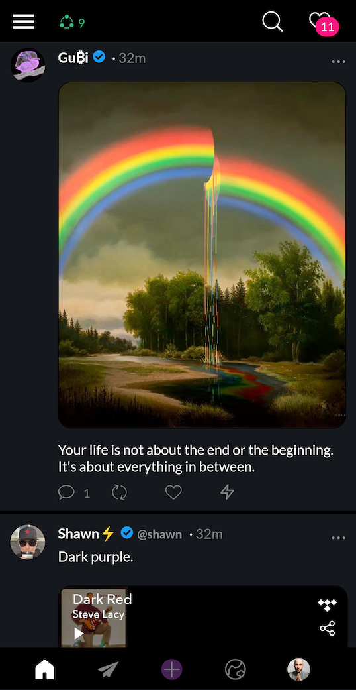
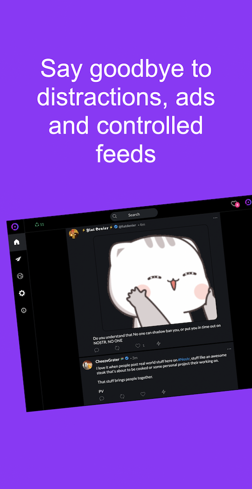

# FAQ: Iris – The app for better social networks

[Iris](https://iris.to/) is a Nostr [Android](https://play.google.com/store/apps/details?id=to.iris.twa), [iOS](https://apps.apple.com/app/iris-the-nostr-client/id1665849007) and [web](https://iris.to/) client for better social networks. 
For desktop (Windows, MacOS, Linux), Docker and other versions, see the [instructions](https://github.com/irislib/iris-messenger).

Create meaningful connections and build your network with Iris. 

Say goodbye to distractions, ads and controlled feeds. Say hello to accessible and secure social networking. Iris gives you complete control over your data and profile.

Choose a name or alias and start connecting with friends and followers. You don't need a phone number or any other personal information to sign up.

Discover a new world of social networking with Iris that is based on a simple, flexible, and open protocol called Nostr that is easy to use and ensures your data is always safe.

Start experiencing the future of social media with Iris.

## Contents

  
<strong>Getting started</strong>

  
  - [How to sign up](#sign-up-get-a-free-nip05--iris-username-in-40-seconds)
  - [Alby support](#alby-support)
  - [Avatar](#avatar)
  - [Profile banner size](#profile-banner-size)
  - [Dark/light theme](#darklight-theme)
  - [Login options](#login-options)
  - [Android version](#android-version)
  - [Username (nostr)](#username-nostr)
  - [Iris username](#iris-username)
  - [Browser version](#browser-version)
  - [iOS app (Apple)](#ios-app-apple)
  - [Testflight](#testflight)

  
<strong>Using Iris</strong>

  - [Audio player](#audio-player)
  - [Backups and Restore](#backups-and-restore)
  - [Block](#block)
  - [Color badges on user names](#color-badges-on-user-names)
  - [Delete Account](#delete-account)
  - [Feed](#feed)
  - [Follower Count](#follower-count)
  - [Following List](#following-list)
  - [Image Links](#image-links)
  - [Embedded Media Formats](#embedded-media-formats)
  - [Likes](#likes)
  - [New User / Not Logged In](#new-user--not-logged-in)
  - [Log in with the Public Key](#log-in-with-the-public-key)
  - [Markdown](#markdown)
  - [Notes](#notes)
  - [New Follower Notifications](#new-follower-notifications)
  - [Notifications](#notifications)
  - [Search Notes](#search-notes)
  - [Upload Media](#upload-media)
  - [Report Notes and Users (Public)](#report-notes-and-users-public)
  - [Undo and Delete](#undo-and-delete)
  - [View As](#view-as)
  - [Webtorrent Magnet Links](#webtorrent-magnet-links)

  
<strong>Lightning</strong>

  - [Lightning Address](#lightning-address)
  - [Receiving Lightning](#receiving-lightning)
  - [Zapping](#zapping)

  
<strong>Privacy and Security</strong>

  - [Key Safety on Browser Apps](#key-safety-on-browser-apps)
  - [Privacy on Uploaded Images](#privacy-on-uploaded-images)
  - [Private Message Privacy (DMs)](#private-message-privacy-dms)
  - [Privacy on Relays](#privacy-on-relays)

  
<strong>Network, Storage, and Relays</strong>

  <ul>
    <li><a href="#caching">Caching</a></li>
    <li><a href="#features-disappeared-or-missing">Features Disappeared or Missing?</a></li>
    <li><a href="#keyword-search">Keyword Search</a></li>
    <li><a href="#local-storage">Local Storage</a></li>
    <li><a href="#nip05-verification-failed">NIP05 Verification Failed</a></li>
    <li><a href="#relays">Relays</a></li>
    <li><a href="#relay-requests">Relay Requests</a></li>
    <li><a href="#umbrel">Umbrel</a></li>
    <li><a href="#timestamps">Timestamps</a></li>
    <li><a href="#what-is-nip-05">What is NIP-05</a></li>
  </ul>

  
<strong>Troubleshooting</strong>

  <ul>
    <li><a href="#try-this-first">Try this first</a></li>
    <li><a href="#posting-does-not-seem-to-work">Posting does not seem to work</a></li>
    <li><a href="#video-is-not-playing-on-note">Video is not playing on note</a></li>
    <li><a href="#why-what-i-am-posting-from-one-device-is-not-always-visible-to-others">Why what I am posting from one device is not always visible to others?</a></li>
    <li><a href="#why-my-picture-is-not-showing-up-on-other-devices">Why my picture is not showing up on other devices?</a></li>
  </ul>

  
<strong>Questions and support</strong>

  <ul>
    <li><a href="#iris-developer">Iris developer</a></li>
    <li><a href="#the-name-iris">The name Iris</a></li>
    <li><a href="#iris-telegram-group">Iris Telegram group</a></li>
    <li><a href="#language-options">Language options</a></li>
  </ul>

## Getting started

## Sign up, get a free NIP05 & Iris username in 40 seconds

https://user-images.githubusercontent.com/52623440/225862232-7ac9a16a-bf14-4745-ad48-3e3a67bc597e.mp4

 There is a growing number of instructions how to use Iris such as [nostr.how](https://www.nostr.how/clients/iris).

### Alby support
Iris web client [works](https://iris.to/post/note1a9m6zcfjsrmulxxqkpe7wj8h580vh5yqrg3389dj5qcvduztlyjsavrv4y) with the [Alby](https://www.getalby.com) extension with multiple keys.

### Avatar
Gif avatars [work](https://iris.to/post/note1jq69869gcds9pqvgxchsmegju9gnn208zgut84z5epwhnhh23d6sfkyjvm) on Iris.

### Profile banner size
1500x500 pixels is the preferred size. 

### Dark/light theme
You can change the theme on settings. Iris will remember your selection even on other clients.

### Login options

Supports npub and window.nostr login as well as Alby and nos2x among other browser extensions. 

You can also paste your public key (npub) if you don't want to make any changes (e.g. follow, write notes, like, read DMs etc.).

### Android version
Google Play store [version](https://play.google.com/store/apps/details?id=to.iris.twa). [(apk)](https://github.com/irislib/iris-messenger/releases)

Iris updates the version automatically. No need to install a new version. Just quit the app and restart if you want to expedite the updating or it does not do it for some reason 🤙

### Username (nostr)
Iris supports profile URLs in the following formats ([examples](https://iris.to/post/note1wn6axvzvnzn8hr45j95qlxpag4u7xcdx79rtk0uet8s5hhqynfhsdfppve)): 
 - `https://iris.to/bob` (bob is an `iris.to/username`)
 - `https://iris.to/alice@example.com` (if you have a NIP05; not your email)
 - `https://iris.to/example.com` (if you have a NIP05 _@example.com)
 - `https://iristo/npub` (nostr public key)
 
The username that you can change in "edit profile" is not unique. However, NIP05 identifiers such as `alice@example.com` are unique. 

### Iris username

Iris username helps users to find your nostr profile easier.

The format is `iris.to/username` (for example: [iris.to/sirius](https://iris.to/sirius)).

You can also use `username@iris.to` format (NIP05; e.g. `sirius@iris.to`) in user searches.

You cannot change your Iris username. They are unique, more than 3 characters long and using letters and numbers only. You can use underscore (\_) but no other special characters are allowed.

Namesquatting, impersonation, vulgar or otherwise offensive usernames may result in you losing your username (also spamming or otherwise abusive username usage).

### Browser version

Iris works on most common browsers: [iris.to](https://iris.to/). 

### iOS app (Apple)
Get Iris from [App store](https://apps.apple.com/app/iris-the-nostr-client/id1665849007).

Iris updates the version automatically. No need to install a new version. Just quit the app and restart if you want to expedite the updating or it does not do it for some reason 🤙

### Testflight

Iris is in Testflight public testing. Join [here](https://testflight.apple.com/join/5xdoDCmG).

Iris updates the version automatically. No need to install a new version. Just quit the app and restart if you want to expedite the updating or it does not do it for some reason 🤙

## Using Iris

### Audio player
Notes can play audio such as mp3-files if your OS or browser suppors it.

### Backups and Restore

You can download (and copy) your profile data and the following list.

You can restore your previous data either by uploading the file (.json) or pasting the same data into the field.

Restoring your old following data will merge it with your current version. The profile data is restored only if it's the latest version (event). All other events are republished (not posted as new).

### Block
User blocks are private. When you block someone on Iris, DMs will be locally removed as well, and any further DMs rejected.
Block lists are stored encrypted to self in event kind 16462.

### Color badges on user names
- Blue =  a followed user
- White = you don't follow but  1-10 of your following follows the user (hover over the icon and Iris shows the count)
- Yellow = you don't follow but over 10 of your following follows the user (hover over the icon and Iris shows the count)

### Delete account

Delete account feature on Account settings resets your profile and following, and disables login to Iris. If you want to come back after deleting your account, sign up again and create a new account.

The delete account option is only available on some versions (e.g. Play and App store).

### Feed

Following feed shows only the people you directly follow.

Global feed shows events from everyone in your extended network of follows that you have configured Iris to accept.

You can adjust your feed experience by setting the following distance limit (or turn it off entirely) from Settings / Social network. Your network starts from you and who you follow and goes forward from there.

You can also adjust the minimum amount of followers required per user at the maximum followed distance you have set that Iris will include in the feed. These settings apply to all your feeds (both Following and Global).

The Social network -settings are stored locally only. If you have multiple clients they are not synched between clients.

### Follower count
The follower count is constructed from your social network's following lists. Iris gathers the data from relays and counts who is following you. There is no single "follower count" as in traditional centralised social media.

The follower count may vary between clients and sessions for this reason. Some relays may be offline or not accessible and therefore the current follower count reflects this. It does not necessarily mean that someone has unfollowed you.

### Following list
Nostr doesn't save individual follows as events, only the most recent version of your contact list. You'd have to save the "followed" event locally either manually or by your client. Keeping more than one nostr client session open (not logged out) is not advised since this may reset your following list.

### Image links
You can post image URLs and the media is shown in the notes. 

### Embedded media formats
Youtube, IG, Spotify, Tidal and Twitch play on notes.

Brave browser issue: Spotify embed may cause Brave to ask to install a Widevine DRM BS extension.

### Likes
Click the number next to the heart in a note to see who liked it.

### New user / not logged in
If a user's name is not found, a deterministic Adjective Animal name is shown instead of the public key (e.g. Grubby Magpie)

### Log in with the public key
If you use a public key to log in you have a read-only view of certain information but cannot add, edit or delete information.

### Markdown
This is not supported yet.

### Notes
There're no restrictions on who sees your posted notes. All notes are public. Clients can change what the user views (see the feed and spam section) but it does not change the fact that nostr handles all notes as public for now (unless they are DM content), and you should consider everything as public. 

For a [quote note](https://iris.to/post/note10ekxar0vvwnt6l098eemfypv3ty0ehtf47lfd8ljz9fv9tvz23psggdn00) (you can also have more than one), copy the NoteID (from the note menu) and paste it on the new note into the position where you want the quoted note.

Mentioning users When writing a note, type @ and wait for the menu to come out and choose the preferred user by clicking it from the menu.

Posting notes [works](https://iris.to/post/note1e8znafpc9sxgq447t6llsc0thp3eh80mh5zy6g6wqhygu8pf8ggq6maj9q) also by pressing cmd/ctrl + return on your keyboard.

### New follower notifications
Iris shows notifications for new followers but doesn't save the notification. The notification is only shown when Iris has locally cached someone's contact list and gets a new version of it (updates were made elsewhere).

### Notifications

Iris shows [notifications](https://iris.to/post/note1esk3s2mkjmtxmew83407ywxt68yg0dcel4vu9knv3u450p86akwsgf2dwk) in one place (the ❤️ on the menu).

### Search notes

You can [search](https://iris.to/post/note1gd35qpaj2tke6ku8rjf4mtnjuafk4y5ghmrvspfse0s2a3stlrcqs5yn95) users by
⚡️ npub
⚡️ NIP05 (`jack@cash.app`)
⚡️ @ (and start typing the name)

Notes by the NoteID (starting with note1)
⚡️ with hashtags and keywords

There's also [support](https://iris.to/post/note1hr7ye9vud7g0jxe3mma0j75gamusrzwhtejth5erqm9v9h5u9j7q3lawa8) for Chinese, Japanese and Korean languages.
Iris search is based on https://nostr.band with its content, results and features.

### Upload media
Video and audio uploads are supported on notes.

You can use the attach media option when writing a note or upload to [imgur](https://imgur.com/upload), [nostr.build](https://www.nostr.build/) or a similar service and then insert the link to the note. The accepted file sizes and media formats depend on the hosting provider.

Iris uploads to [nostr.build](https://www.nostr.build/) when using the attach media option and inserts the media link(s) after a successful upload.

### Report notes and users (public)
You can publicly report users' posts. It publishes a delete event for the reported note in Nostr.

The users you choose to report are blocked on your feed and the list of your reported users is public.

### Undo and delete
In the note menu, there’s a delete option for notes. It’s up to relays and other clients to respect it so consider it more as a wish than anything else. Hidden or ignored is not deleted. This is how nostr protocol works. Unboosting and unliking work the same way (not available yet).

### View as

Iris allows you to view other accounts with their public key (a nostr protocol feature) if you're using a browser extension login. Visit the user's profile and open the user's profile menu and select the "[View as...](https://iris.to/post/note19nlkcm50kv4jfujhnprrgwa0m07s0wj7gqh663pu87sfgytgs6jqu32st4)" option.

### Webtorrent magnet links
Notes preview and play Magnet webtorrent media links (may not work on mobile devices).

## Lightning

### Lightning address
`lightning:iristoapp@getalby.com` format is supported. Add your lightning wallet in the edit profile section.

### Receiving lightning
Issue a Lightning invoice or you can also use `lightning:iristoapp@getalby.com`format.

### Zapping

You can zap by clicking the ⚡️ button. Your mobile wallet needs to be registered on the device for the link to be recognised when you click it.

Lightning wallets are starting to implement the zapping feature. You could try
www.walletofsatoshi.com for mobile or https://getalby.com for desktop, for example. The technical term is [NIP-57](https://github.com/nostr-protocol/nips/blob/master/57.md).

The ⚡️ is a lightning: link to the user's address ([see how it works](https://iris.to/post/note10uvvg0drlevur3y3cy6xgncwyg7ww28222yrkpfjy6kcc9w9d72qjnn5qp)).

## Privacy and security

### Key safety on browser apps
Browser applications are not signed by the developer unlike native apps and browser extensions. Someone could hack the server or DNS and serve malicious code that steals your private key. XSS is also a risk, although not common in applications that use a framework like react.

### Privacy on uploaded images
Image loading is done via proxy to resize and avoid IP leaking unless it's from a whitelisted (e.g. imgur.com and nostr.build) service.

### Private message privacy (DMs)
Only the message content is encrypted: the sender, recipient and timestamp are visible to everyone.

### Privacy on relays
Your internet protocol (IP) address is exposed to the relays you connect to. If you want to improve your privacy, consider utilizing a service that masks your IP address (e.g. a VPN) from trackers online. You can also connect to Iris messenger on [Tor Browser]([url](https://www.torproject.org/)), which will mask your IP address. 

The relay also learns which public keys you are requesting, meaning your public key will be tied to your IP address.

## Network, storage and relays

### Caching
Iris caches profiles, follows and the latest notes for a faster and better user experience.

### Features disappeared or missing?

If you force refresh on your browser that might help (cmd/ctrl +R in some browsers) or quitting the app may also help clear the local cache ([iOS](https://support.apple.com/en-us/HT201330)).

### Keyword search
Keyword search works with relays that have implemented it.

### Local storage
Iris stores a few of the latest messages, contacts and metadata for better user experience.

### NIP05 verification failed
If your NIP05 is not showing on your profile, check whether you have technical errors in the NIP05 implementation (e.g. CORS error).

if your NIP05 shows as valid on one client, but invalid on the other it could be a local cache issue. Try cmd/cntr + R to do a force refresh on the browser, or quit and restart the app.

### Relays
The relays Iris uses can change over time since they reflect the content you're viewing.

You can add, remove and disable (and enable with ☑) relays. By saving publicly the current relay list is published and you can use it on other clients.

Iris account has usually between 8-13 active relays and runs smoothly. 

### Relay requests
Iris asks for 1000 latest events from known users initially. Some relays don't like the large authors filter (100-2000). Then it subscribes to all upcoming messages but discards those that are from unknown authors. When you open someone's profile, all their events are queried.

### Umbrel
Iris may not work with ws: but only with wss: (using webcrypto api). Browsers don't let you connect to a non-secure address (ws) if the page is loaded from a secure origin (https).

### Timestamps
Iris saves the notifications and DM threads' last seen timestamp for easier client synchronisation.

### What is NIP-05
The NIP-05 identifier is an easier way to find your public key profile. Just like email addresses, many people can have the same NIP05 name (e.g. Alice), but not on the same domain (e.g. `alice@domain.com`).

## Troubleshooting

### Try this first

If you force refresh on your browser that might help (cmd/ctrl +R in some browsers) or quitting the app may also help clear the local cache ([iOS](https://support.apple.com/en-us/HT201330) instructions).

### Posting does not seem to work

It could be that you're not logged in with your private key, you're offline or not connected to the relays. A quick way to see whether you're logged in with your private key (nsec) is to see whether the DMs are open and whether you can read their content.

If your relays are not allowing you to write to them new events you may have only read-only access (usually with paid relays). 

### Video is not playing on note

If the original video format is not supported by your browser or operating system Iris cannot play it. For example, Chrome (and Chromium-based browsers such as Brave) do not play Apple's QuickTime format (.mov).

The file could also be corrupted, or not downloaded completely or if you have disabled embeds on the Settings menu it may not play either.

### Why what I am posting from one device is not always visible to others?

It could be that your other client's relays have not picked it up. 

Copy the noteid from one client and paste it into the Iris search box on the other and see whether it comes up. 

If you're sure that it is published you could try to "Resend to relays" from the note menu. 

It could also be that you're not logged in with your private key, you're offline or not connected to the relays. A quick way to see whether you're logged in with your private key (nsec) is to see whether the DMs are open and whether you can read their content.

### Why my picture is not showing up on other devices?

See the previous [answer](https://github.com/irislib/faq#why-what-i-am-posting-from-one-device-is-not-always-visible-to-others) first.

Iris uploads the pictures to a third-party service (e.g. www.nostr.build ) so it's a possibility that something is not working on their end. Yet, if you can get the picture URL from the original post (for example, "Copy raw data" from the note menu) and paste it on a browser you can verify whether it's available and visible.

## Questions and support

Please note that this FAQ section is a work-in-progress. The information may have already changed due to the frequent app and network updates.

If you cannot find the answer to your question, you can always reach out to other Iris and Nostr users for assistance.

### Iris developer
[Martti Malmi](https://iris.to/npub1g53mukxnjkcmr94fhryzkqutdz2ukq4ks0gvy5af25rgmwsl4ngq43drvk) develops Iris full-time.

### The name Iris
Iris is the Greek goddess of the rainbow and the messenger of gods. Iris means rainbow in ancient Greek. The iris of the eye is named so because of its many colors. Eyes are essential for human communication. Iris users could be called [iridians](https://en.wiktionary.org/wiki/iridian).

### Iris Telegram group
Join the Iris.to telegram group: https://t.me/+u-qC51vCUWQ3NmRk

### Language options
If you would like to contribute to better translations, please [visit](https://docs.google.com/spreadsheets/d/19VSmmqqq5zpOcKIS2H8bHcVeG3Bby5aW8Q_4LykPUao/edit?usp=sharing).
